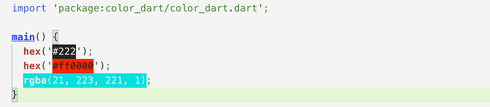

# color_dart

display color in development

## 效果图
;

## 使用

* hex(String hexColor)

```
hex('#222);
hex('#ff0000');
```

* rgba(int r, int g, int b, double a)

```
rgba(0,0,0,1);
```

## vscode配置

安装[Color Highlight](https://marketplace.visualstudio.com/items?itemName=naumovs.color-highlight);
